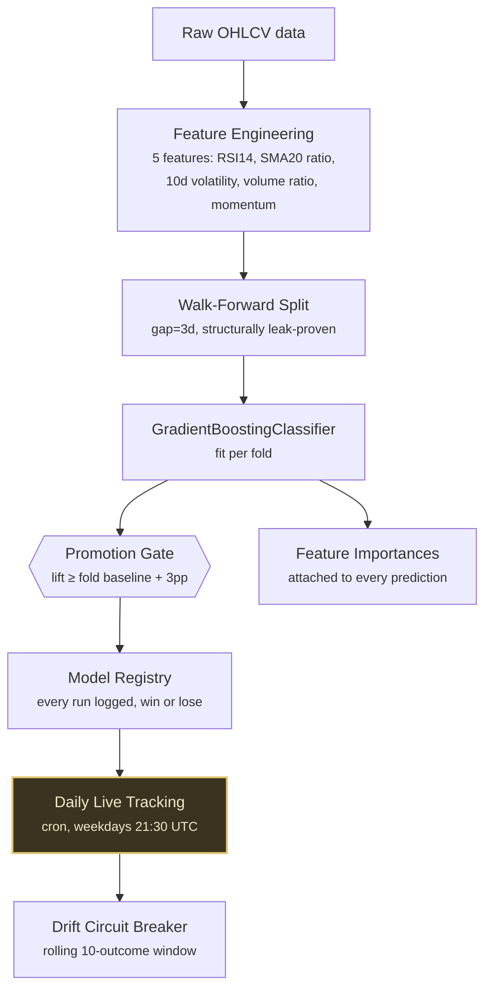

# ML Signal Reliability Patterns

A small, real, walk-forward-validated equity direction model, built and governed to the standard an institutional ML review (a bank, a fund, a company running models against real money) actually holds a candidate to — not a Kaggle-style accuracy number, the discipline around it: no lookahead, a hard promotion gate, a drift circuit breaker, explainability attached to every prediction, and honest reporting when the model doesn't clear its own bar.

**Why this exists:** a portfolio of "it works" model notebooks proves you can fit a classifier. It doesn't prove you can validate one correctly, govern its promotion to production, or report its failure honestly instead of hiding it — the things a lead quant/ML engineer or hiring panel actually screens for. See [`EVALUATION_RUBRIC.md`](EVALUATION_RUBRIC.md) for the full 9-point standard this repo is built against, and the sibling repo [`pipeline-reliability-patterns`](https://github.com/mboyajeffers/pipeline-reliability-patterns) for the same doctrine applied to data pipelines instead of models.

## What's here

| Piece | What it proves |
|---|---|
| [`model/pipeline.py`](model/pipeline.py) | Walk-forward validation with an explicit gap, a lift-over-baseline promotion gate, a rolling-accuracy circuit breaker |
| [`model/BUILD_LOG.md`](model/BUILD_LOG.md) | 2 real issues found while building this, fixed, and test-pinned — including a real, unmodified live-validation run that the model *failed* |
| [`model/tests/`](model/tests/) | Every fixed bug proven twice — an `xfail` against the pre-fix behavior, a passing test against the fix |
| [`live/`](live/) | A daily GitHub Actions cron that re-validates against live data and appends one real, dated record to `track_record.jsonl` — win or lose, every day, not just the good ones |

## Architecture



A fuller reference — this same diagram, a real build/decision timeline, and a live-verified status board across this repo and [`pipeline-reliability-patterns`](https://github.com/mboyajeffers/pipeline-reliability-patterns) — is at [mboyajeffers.github.io/reliability-patterns/architecture/](https://mboyajeffers.github.io/reliability-patterns/architecture/).

## Run it yourself

```bash
git clone https://github.com/mboyajeffers/ml-signal-reliability-patterns
cd ml-signal-reliability-patterns
pip install -r requirements.txt
pytest -v                              # deterministic, no network required
python model/pipeline.py --live --ticker SPY   # hits real Yahoo Finance data
```

## Backtested vs. live — read this before citing any number from this repo

- **Walk-forward validation numbers** (in `model/BUILD_LOG.md`, in any `model_registry.json` entry) are backtested — real historical data, a real methodology with no lookahead, but not a claim about future or live performance.
- **`live/track_record.jsonl`** is the live layer: one real, dated entry appended every trading day by an automated cron, starting 2026-08-20. This is what actually earns the word "live" — a growing, third-party-verifiable, git-committed log, not a number in a README. Check the commit history on this file directly; don't take a summary's word for it.
- This account has previously had to walk back a public claim that blurred this exact line (a backtested trading-signal number that read as a live one). Every number in this repo is labeled which kind it is, every time, on purpose.

## What this is / isn't

**Is:** a demonstration of ML engineering discipline — walk-forward validation, governance, drift monitoring, honest failure reporting — built fresh, using real live public data (Yahoo Finance, no key required), independent of any private system's architecture or infrastructure.

**Isn't:** a framework, investment/trading advice, a claim that any specific employer's actual production ML system looks like this, or (currently) a working trading signal — the model as built here does not yet clear its own promotion gate on any single-ticker configuration tested (SPY, AAPL, MSFT, QQQ — see `model/BUILD_LOG.md`). That's disclosed, not hidden, and is itself part of what this repo demonstrates: a gate that always finds a way to pass isn't a gate.

## Personal use

This repo also runs as the author's own daily signal check — `live/track_record.jsonl` is read, not automatically traded on. It deliberately never places an order or touches a broker API; extending it to do so would be a clean, separate fast-follow (see `model/README.md`), not part of this repo's current scope.

## More

- **Full rubric:** [`EVALUATION_RUBRIC.md`](EVALUATION_RUBRIC.md)
- **About the author:** [github.com/mboyajeffers](https://github.com/mboyajeffers) · [mboyajeffers.github.io](https://mboyajeffers.github.io)
